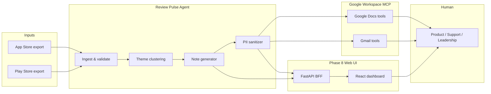

# Architecture — Weekly App Review Pulse Agent (MCP)

This document defines the **system architecture** for the Milestone 3 AI agent that turns public App Store and Play Store review exports into a weekly pulse, then publishes via **Google Workspace MCP** (Docs + Gmail). Requirements live in [problemStatement.md](./problemStatement.md). Implementation order is in [phasewiseImplementationPlan.md](./phasewiseImplementationPlan.md).

---

## 1. Architectural goals

| Goal | How the architecture enforces it |
|------|----------------------------------|
| **Actionable pulse** | Fixed output schema: top 3 themes, 3 quotes, 3 actions, ≤250 words |
| **Bounded themes** | Clustering capped at **5** themes; note surfaces **top 3** only |
| **No PII** | Sanitization layer before any artifact; blocklist for usernames/emails/IDs |
| **Public data only** | Ingest from exported CSV/JSON files — no authenticated store scraping |
| **MCP for Google** | Docs and Gmail are **only** reached through Workspace MCP tools in Cursor — no `googleapis` in app code |
| **Reproducibility** | Versioned prompts, saved intermediate JSON, deterministic date windows (8–12 weeks) |
| **Readable delivery** | Phase 8 web dashboard surfaces pulse, themes, and publish status for non-CLI users |

**High-level pattern:** **Ingest → Normalize → Cluster → Summarize → Sanitize → Publish (MCP) → Present (web UI)**.

---

## 2. System context



The **agent** runs inside Cursor (or an SDK-driven agent with the same MCP servers attached). It uses **local tools** (filesystem, Python scripts, LLM) for review processing and **MCP tools** exclusively for Google Docs and Gmail. **Phase 8** adds a browser dashboard that reads pipeline artifacts via a thin API — it does not replace MCP for Google publish.

---

## 3. Component architecture

```text
┌──────────────────────────────────────────────────────────────────────────┐
│                     Cursor Agent (orchestrator)                           │
│  System prompt + phase skills + tool routing (local vs MCP)               │
└──────────────────────────────────────────────────────────────────────────┘
         │                    │                    │                 │
         ▼                    ▼                    ▼                 ▼
┌─────────────┐    ┌──────────────────┐    ┌─────────────┐   ┌─────────────────┐
│ Ingest      │    │ Theme engine     │    │ Note        │   │ MCP publish     │
│ pipeline    │───►│ (≤5 themes)      │───►│ composer    │──►│ layer           │
│             │    │                  │    │ (≤250 words)│   │                 │
└─────────────┘    └──────────────────┘    └─────────────┘   └────────┬────────┘
         │                    │                    │                    │
         │                    │                    ▼                    │
         │                    │            ┌─────────────┐              │
         │                    │            │ PII         │              │
         │                    │            │ sanitizer   │              │
         │                    │            └─────────────┘              │
         │                    │                                         ▼
         ▼                    ▼                              ┌──────────────────────┐
   data/reviews/         data/themes/                       │ Google Workspace MCP │
   (normalized JSON)    data/weekly/                        │ • create/update Doc  │
                          (draft note JSON)                 │ • create Gmail draft │
         │                    │                    │                 │
         └────────────────────┴────────────────────┘                 │
                              │                                      ▼
                              ▼                          ┌──────────────────────┐
                    ┌─────────────────┐                  │ HTTP MCP server      │
                    │ Phase 8 BFF     │                  │ (Render)             │
                    │ (read artifacts)│                  └──────────────────────┘
                    └────────┬────────┘
                             ▼
                    ┌─────────────────┐
                    │ React dashboard │
                    │ (Vite + TS)     │
                    └─────────────────┘
```

### 3.1 Ingest pipeline (local)

**Responsibility:** Load 8–12 weeks of reviews from public exports; unify schema across stores.

| Field | Required | Notes |
|-------|----------|--------|
| `rating` | Yes | Normalize to 1–5 |
| `title` | Yes | May be empty on some Play exports |
| `text` | Yes | Body of review |
| `date` | Yes | ISO 8601; filter by rolling window |
| `store` | Yes | `app_store` \| `play_store` |
| `review_id` | Internal only | Used for dedup; **never** written to Doc/draft |

**Outputs:** `data/reviews/normalized.jsonl` (or per-week shards).

**Rules:**

- Reject rows outside the date window with a logged count.
- **Content normalization:** keep reviews with ≥6 English words (title + body), drop non-English and emoji-containing text (`configs/phase1_ingest.yaml`).
- Deduplicate on stable store-provided id or hash of `(date, title, text)`.
- No network calls to Apple/Google beyond reading local export files.

### 3.2 Theme engine (sample → Groq → local rank)

**Responsibility:** Assign each **sampled** review to one of **≤5** themes; rank themes by volume and severity.

**LLM:** Groq **`llama-3.3-70b-versatile`** via `GROQ_API_KEY`. Prompts in `prompts/themes.md`; **JSON-only** responses.

| Component | Technology |
|-----------|------------|
| Corpus cap | Local sampler → `data/reviews/phase2_sample.jsonl` |
| Theme classification | Groq batched chat (throttled) |
| Ranking / aggregation | Local Python (**no Groq**) |
| Google Docs / Gmail | MCP only (Phases 5–6) |

#### Groq rate limits (design constraints)

| Limit | Quota | Architecture response |
|-------|------:|----------------------|
| Tokens / day | **100,000** | Sample **≤ 450** reviews/run; hard stop at **90,000** tokens |
| Tokens / minute | **12,000** | Batches of **40** reviews; **~10,000** TPM soft cap + sleep |
| Requests / minute | **30** | **≥ 25s** between Groq calls (~2 RPM) |
| Requests / day | **1,000** | ~12 calls/run — not a binding constraint |

Phase 1 may produce **800+** rows in `normalized.jsonl`; Phase 2 **must not** send all rows to Groq in one day on this tier (~110k+ tokens). Full corpus stays on disk for audit; clustering uses **`phase2_sample.jsonl`** only.

```text
normalized.jsonl ──► sample (stratified, max 450) ──► phase2_sample.jsonl
                                                          │
                        ┌─────────────────────────────────┘
                        ▼
              Groq batch 1..N  (40 reviews, 25s gap, token meter)
                        │
                        ▼
              merge ──► clusters.json ──► ranked.json (local)
```

**Batch payload (minimize tokens):** `review_id`, `rating`, `text` truncated to 200 chars. **No** title in prompt unless A/B shows quality loss.

**Sampling (default):**

- Stratify by `app_store` / `play_store`
- Newest `date` first within each store
- Cap **`max_reviews_per_run`: 450** (config: `configs/phase2_themes.yaml`)

**Suggested theme vocabulary (Groww-aligned):** onboarding, KYC, payments, statements, withdrawals — still **≤5 total**.

**Outputs:**

- `data/reviews/phase2_sample.jsonl` — Groq input subset (+ metadata: `sampled_at`, `source_count`)
- `data/themes/clusters.json` — theme id, label, `review_ids` (sampled only)
- `data/themes/ranked.json` — ordered list for top-3 selection (Phase 3)

**Deferred:** Embeddings + k-means (Option B) — use only if Groq tier increases or sample cap is removed.

### 3.3 Note composer (local + LLM)

**Responsibility:** Produce the weekly pulse markdown from ranked themes.

**Fixed sections:**

1. **Title** — e.g. `Groww — Weekly Review Pulse (YYYY-MM-DD)`
2. **Top 3 themes** — one line each with trend hint (↑/↓/→) if prior week exists
3. **3 user quotes** — paraphrased; no usernames
4. **3 action ideas** — specific, owner-agnostic

**Output:** `data/weekly/note.md` and `data/weekly/note.json` (structured for MCP).

**Hard limit:** ≤250 words body (validator script recommended).

### 3.4 PII sanitizer (local)

**Responsibility:** Last gate before MCP publish.

**Checks:**

- Regex: emails, phone patterns, `@handles`, long numeric IDs
- Blocklist: reviewer names if present in export
- LLM pass (optional): “redact any remaining PII”

**On failure:** Halt publish; write `data/weekly/blockers.json` with reasons.

### 3.5 MCP publish layer (Google only via MCP)

**Responsibility:** Create/update Google Doc and Gmail draft using MCP tool calls — **not** REST clients in the repo.

| Action | MCP surface (example tool names) | App code |
|--------|----------------------------------|----------|
| Create weekly Doc | Docs: create document, append/replace body | **None** — agent calls MCP |
| Update existing Doc | Docs: read + batch update | **None** |
| Draft email | Gmail: create draft | **None** |

**Recommended server:** [Google Workspace MCP](https://github.com/Dave-Nguyen-PM/google-workplace-mcp) configured in Cursor (`~/.cursor/mcp.json`).

**Configuration (conceptual):**

```json
{
  "mcpServers": {
    "google-workspace": {
      "command": "npx",
      "args": ["-y", "@anthropic/... or package from repo README"],
      "env": {
        "GOOGLE_OAUTH_CLIENT_ID": "...",
        "GOOGLE_OAUTH_CLIENT_SECRET": "..."
      }
    }
  }
}
```

Exact package name and env vars follow the chosen MCP server’s README. OAuth completes in browser once per machine.

**Publish contract:**

| Artifact | MCP target | Idempotency |
|----------|------------|-------------|
| Weekly note | Google Doc titled `Weekly Review Pulse — Groww — <date>` | Same week → update same Doc id stored in `data/weekly/publish_state.json` |
| Email | Gmail draft to `SELF_EMAIL` or alias | New draft each run unless MCP supports update-by-draft-id |

### 3.6 Web dashboard (Phase 8 — presentation layer)

**Responsibility:** Present the weekly pulse, theme analytics, and pipeline/publish status in a **proper frontend** for product, support, and leadership. Read-only by default; optional admin actions via BFF.

**Stack:**

| Layer | Technology | Role |
|-------|------------|------|
| UI | React 18, Vite, TypeScript, Tailwind CSS | Pages, components, charts |
| BFF | FastAPI (`pipelines/phase8_frontend/api/`) | Serve JSON from `data/`; optional run/publish proxies |
| Data | Existing artifacts | `note.json`, `ranked.json`, `publish_state.json`, `blockers.json` |

**Does not:**

- Import `googleapis` or embed Google OAuth in the browser
- Display `review_id`, raw reviewer handles, or full export rows
- Store API keys in `localStorage`

**Core UI modules:**

```text
┌─────────────────────────────────────────────────────────────┐
│ AppShell (nav: Dashboard | Pulse | Themes | Pipeline | ⚙)   │
├─────────────────────────────────────────────────────────────┤
│  Dashboard          │  PulsePage          │  ThemesPage        │
│  • week snapshot    │  • note.md render   │  • rank list       │
│  • PII chip         │  • note.json panels │  • share chart     │
│  • Doc/Draft links  │  • word count badge │  • theme drawer    │
├─────────────────────┴─────────────────────┴────────────────────┤
│  PipelinePage                    │  SettingsPage              │
│  • phase 1–7 stepper             │  • week selector           │
│  • blockers alert                │  • API URL (dev)             │
│  • GHA schedule info             │                            │
└─────────────────────────────────────────────────────────────┘
```

**API surface (BFF):**

| Endpoint | Source artifact |
|----------|-----------------|
| `GET /api/v1/pulse/latest` | `data/weekly/note.json`, `note.md` |
| `GET /api/v1/themes/ranked` | `data/themes/ranked.json` |
| `GET /api/v1/themes/clusters` | `data/themes/clusters.json` (aggregates only in UI) |
| `GET /api/v1/pipeline/status` | `blockers.json`, artifact presence, validators |
| `GET /api/v1/publish/state` | `data/weekly/publish_state.json` |

**Publish UX:** `DocLinkCard` and `DraftLinkCard` open `doc_url` and Gmail Drafts in a new tab — same URLs as Phase 5–6, no in-app Google SDK.

**Deployment pattern:**

```text
[GitHub Actions / local scripts] → data/*.json
                                        │
                                        ▼
                                 FastAPI BFF
                                        │
                                        ▼
                              Static React (CDN)
                                        │
                                        ▼
                                    Browser
```

---

## 4. MCP vs local boundary

```text
┌─────────────────────────────────────┐  ┌─────────────────────────────────────┐
│ LOCAL (repo scripts / agent tools)   │  │ MCP (Google Workspace server)        │
├─────────────────────────────────────┤  ├─────────────────────────────────────┤
│ Read CSV/JSON exports                │  │ Google Docs: create, read, write     │
│ Date filter, dedup, normalize        │  │ Gmail: create draft, (optional) send │
│ Theme clustering & ranking           │  │ OAuth token lifecycle (inside MCP)   │
│ Note generation & word-count check   │  │                                      │
│ PII sanitization                     │  │ ❌ Do NOT duplicate with googleapis   │
│ Phase 8 BFF (read artifacts)         │  │                                      │
│ React UI (display + external links)  │  │                                      │
└─────────────────────────────────────┘  └─────────────────────────────────────┘
```

**Rule:** If an operation touches Gmail or Google Docs, the agent must invoke an MCP tool visible in Cursor’s MCP tool list (or the HTTP MCP server via `publish_*.py`). Python/Node code in this repo must not import Google API client libraries for those surfaces. The Phase 8 frontend links out to Google; it does not embed Docs/Gmail clients.

---

## 5. Agent orchestration model

### 5.1 Roles

| Role | Description |
|------|-------------|
| **Orchestrator** | Cursor chat agent or SDK `Agent` with MCP enabled |
| **Worker scripts** | Optional `scripts/` for deterministic ingest, validation, word count |
| **MCP server** | External process; exposes Docs/Gmail tools |

### 5.2 Typical tool flow (one weekly run)

1. Run `scripts/ingest_reviews.py` → normalized JSONL
2. Sample reviews → `phase2_sample.jsonl`; throttled **Groq** batches → `clusters.json`; local rank → `ranked.json`
3. Agent calls LLM → `note.md` / `note.json`
4. Run `scripts/validate_note.py` (word count, schema, PII scan)
5. Agent **CallMcpTool** → create/update Doc with `note.md` body
6. Agent **CallMcpTool** → create Gmail draft (subject + plain/HTML body)
7. Write `publish_state.json` (doc id, draft id, timestamp)
8. (Phase 8) BFF serves artifacts → dashboard refreshes for stakeholders

### 5.3 Prompting strategy

- **System prompt:** Product context (Groww), constraints (≤5 themes, ≤250 words, no PII), output schema
- **Theme prompt:** Closed set of theme labels; require JSON-only response for parsing
- **Note prompt:** Executive tone; bullet-friendly; no advice beyond “action ideas” for product teams

Store prompts under `prompts/` for version control.

---

## 6. Data layout (recommended repo structure)

```text
Milestone3/
├── doc/
│   ├── problemStatement.md
│   ├── architecture.md          ← this file
│   ├── phasewiseImplementationPlan.md
│   └── runbook.md
├── frontend/                      # Phase 8 — React + Vite + Tailwind
│   ├── src/
│   │   ├── components/            # layout, pulse, themes, pipeline, publish
│   │   ├── pages/
│   │   ├── hooks/
│   │   ├── services/api.ts
│   │   └── types/pulse.ts
│   └── package.json
├── pipelines/
│   └── phase8_frontend/
│       └── api/                     # FastAPI BFF — read data/ artifacts
├── data/
│   ├── raw/                       # App Store / Play CSV exports (gitignored if large)
│   ├── reviews/                   # normalized.jsonl
│   ├── themes/                    # clusters.json, ranked.json
│   └── weekly/                    # note.md, note.json, publish_state.json
│       └── history/               # optional archived weeks (Phase 8)
├── prompts/
│   ├── system.md
│   ├── themes.md
│   └── weekly_note.md
├── scripts/
│   ├── ingest_reviews.py
│   ├── run_weekly_pulse.py
│   ├── validate_note.py
│   └── check_pii.py
├── .github/workflows/
│   └── weekly_pulse.yml
└── .cursor/
    └── rules/                     # MCP-only Google rule
```

---

## 7. Security and compliance

| Topic | Approach |
|-------|----------|
| **Credentials** | OAuth owned by MCP server; secrets in env / Cursor MCP config — not committed |
| **PII** | Sanitize before MCP; never log raw reviewer handles in agent transcripts used for demos |
| **Data residency** | Review exports stay local; only the sanitized note crosses into Google |
| **Scopes** | Request minimal OAuth scopes (Docs + Gmail compose/draft only) |

---

## 8. Observability and testing

| Check | Method |
|-------|--------|
| Ingest coverage | Count reviews in window vs source export |
| Theme cap | Assert `len(themes) <= 5` |
| Note length | `validate_note.py` word count ≤250 |
| PII | `check_pii.py` on `note.md` |
| MCP publish | Manual: open Doc URL and Gmail drafts folder |
| E2E | One command or agent skill: “Run weekly pulse” |
| Dashboard | UI loads `/api/v1/pulse/latest`; Lighthouse accessibility smoke |

---

## 9. Related documents

- [problemStatement.md](./problemStatement.md) — requirements and constraints
- [phasewiseImplementationPlan.md](./phasewiseImplementationPlan.md) — phased build order and exit criteria
- [google-stitch-phase8-ui.md](./google-stitch-phase8-ui.md) — Stitch UI prompts (Groww visual language)
- [eval/README.md](./eval/README.md) — per-phase `eval.md` testing and sign-off checklists
- [decision.md](./decision.md) — business and technical decision log (ADR-style)
