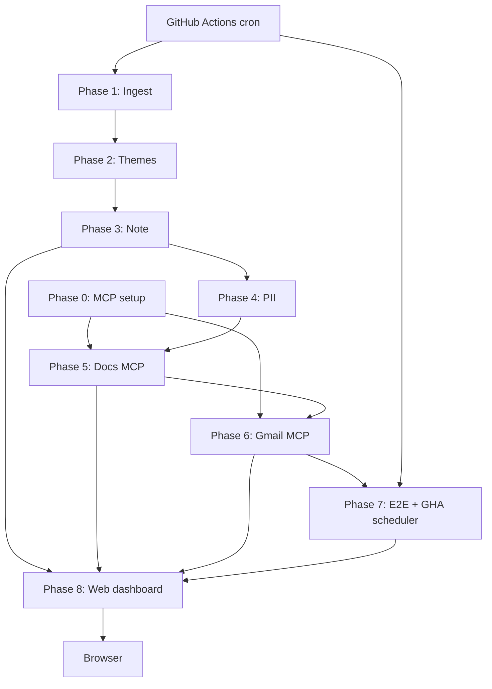

# Phase-Wise Implementation Plan — Review Pulse Agent (MCP)

This document is the **implementation roadmap** for the weekly App Store / Play Store review pulse agent defined in [problemStatement.md](./problemStatement.md). System design and component boundaries are in [architecture.md](./architecture.md).

Phases are **sequential**: each phase produces artifacts and interfaces the next phase consumes. Do not wire Google Docs or Gmail until **Phase 0** (MCP) is complete.

---

## Overview

| Phase | Name | Primary output |
|-------|------|----------------|
| **0** | MCP & project scaffold | Working Google Workspace MCP in Cursor |
| **1** | Review ingest & validation | `data/reviews/normalized.jsonl` |
| **2** | Theme clustering (≤5, **Groq**, sampled + throttled) | `phase2_sample.jsonl`, `clusters.json`, `ranked.json` |
| **3** | Weekly note generation | `data/weekly/note.md` (≤250 words) |
| **4** | PII sanitization gate | Clean note + `check_pii` passing |
| **5** | Publish via MCP (Docs) | Google Doc URL + `publish_state.json` |
| **6** | Publish via MCP (Gmail) | Gmail draft in mailbox |
| **7** | E2E workflow + **GitHub Actions scheduler** | Runbook + weekly automated data refresh (CI) |
| **8** | **Web dashboard (frontend)** | Groww-branded UI for pulse, themes, pipeline status, publish links |

**Testing & exit criteria:** Each phase has an evaluation file under [doc/eval/](./eval/README.md) with automated checks, manual steps, and sign-off checklists.

---

## Phase 0 — MCP setup and project scaffold

**Objective:** Cursor can call Google Docs and Gmail tools through MCP; repo skeleton exists.

### Activities

1. **Choose MCP server** — [Google Workspace MCP](https://github.com/Dave-Nguyen-PM/google-workplace-mcp) (or course-approved equivalent with Docs + Gmail draft tools).
2. **Google Cloud OAuth** — Create OAuth client (Desktop app); enable Gmail API and Google Docs API (and Drive if required by server).
3. **Configure Cursor** — Add server entry to `~/.cursor/mcp.json` (or Cursor Settings → MCP); set client id/secret via env.
4. **Authorize once** — Complete browser OAuth; confirm tools appear in Cursor MCP panel.
5. **Smoke test (manual)** — Agent creates a test Doc titled `MCP Smoke Test` and a Gmail draft to yourself; delete afterward.
6. **Scaffold repo** — Create `data/`, `prompts/`, `scripts/` per [architecture.md](./architecture.md); add `.gitignore` for `data/raw/`, secrets, OAuth tokens.

### Exit criteria

- [ ] MCP server shows **Docs** and **Gmail** tools in Cursor
- [ ] Smoke-test Doc and draft created **without** any `googleapis` code in this repo
- [ ] Folder layout and gitignore in place

**Evaluation:** [doc/eval/phase-00/eval.md](./eval/phase-00/eval.md)

### Agent instruction snippet (save to `prompts/mcp_publish.md` later)

> For Google Docs and Gmail, always use MCP tools. Never suggest implementing Gmail or Docs REST clients in Python/Node.

---

## Phase 1 — Review ingest and validation

**Objective:** Deterministic pipeline from public exports to normalized reviews for the last **8–12 weeks**.

### Activities

1. **Obtain exports** — App Store Connect / Play Console CSV or JSON (public export workflow only; no scraping behind login in code).
2. **Place files** — `data/raw/app_store.*`, `data/raw/play_store.*`
3. **Implement ingest** — `pipelines/phase1_ingest/` (CLI: `scripts/ingest_reviews.py`)
   - Map columns → canonical schema: `rating`, `title`, `text`, `date`, `store`, `review_id`
   - Parse dates; filter to configurable window (default 12 weeks, min 8)
   - Dedupe; log dropped rows
4. **Validation script** — Assert required fields, rating range, non-empty `text` for included rows
5. **Output** — `data/reviews/normalized.jsonl`

### Exit criteria

- [ ] ≥1 App Store and ≥1 Play Store file ingested
- [ ] All rows in window; invalid rows logged not silently dropped
- [ ] `review_id` present for dedup but documented as **never** for publish

**Evaluation:** [doc/eval/phase-01/eval.md](./eval/phase-01/eval.md)

---

## Phase 2 — Theme clustering (max 5 themes)

**Objective:** Group reviews into ≤5 themes and rank for “top 3” selection.

### LLM — Groq (`llama-3.3-70b-versatile`)

Theme assignment uses **[Groq](https://groq.com/)** with model **`llama-3.3-70b-versatile`**. Phase 2 does **not** use MCP.

| Setting | Value |
|---------|--------|
| **Provider** | Groq |
| **API key** | `GROQ_API_KEY` in `.env` (not committed) |
| **Model** | `llama-3.3-70b-versatile` (override with `GROQ_MODEL`) |
| **Usage** | Throttled batched JSON classification per `prompts/themes.md` |

#### Groq free-tier limits (this model)

| Limit | Quota | Phase 2 guardrail |
|-------|------:|-------------------|
| Requests / minute | 30 | ≤ **2** Groq calls/min (25s spacing) |
| Requests / day | 1,000 | ~**12** calls/run → ample headroom |
| Tokens / minute | 12,000 | ≤ **~10,000** TPM rolling; **40** reviews/batch |
| Tokens / day | 100,000 | **≤ 90,000** tokens/run; **sample** reviews first |

**Why sampling:** A full run on all **~848** normalized reviews is ~**110k+** tokens — above the **100k/day** cap. Phase 1 keeps the full `normalized.jsonl`; Phase 2 clusters a **representative subset** only.

#### Chosen approach (rate-limit safe)

**Option A — throttled batch labeling** (recommended). **Not** Option B for now (embeddings add complexity; marginal token savings not needed at sampled size).

```text
normalized.jsonl (all reviews, Phase 1)
        │
        ▼
  sample_for_phase2.py   ← stratified cap (default 450 reviews)
        │
        ▼
  phase2_sample.jsonl
        │
        ▼
  Groq batches (40 reviews/call, 25s pause, token counters)
        │
        ▼
  clusters.json + ranked.json
```

| Parameter | Default | Rationale |
|-----------|--------:|-----------|
| `max_reviews_per_run` | **450** | ~55–70k tokens/run at ~120–150 tokens/review; leaves room for retries under **100k/day** |
| `batch_size` | **40** | ~3.5–5k tokens/call (in+out) → fits **12k TPM** with spacing |
| `inter_request_delay_sec` | **25** | ≤ 2.4 calls/min → stays under RPM and TPM |
| `daily_token_budget` | **90,000** | Stop Groq calls if cumulative tokens exceed budget |
| `tpm_soft_limit` | **10,000** | If last 60s usage ≥ limit, sleep until window clears |

**Sampling rules** (before any Groq call):

1. Read `data/reviews/normalized.jsonl`.
2. Stratify by `store` (`app_store` / `play_store`) — preserve mix.
3. Within each store, prefer **newest** `date` first.
4. Take up to `max_reviews_per_run` total (default **450**).
5. Write `data/reviews/phase2_sample.jsonl` + log original vs sampled counts.

**Per-batch payload (keep tokens low):**

- Send only: `review_id`, `rating`, truncated `text` (e.g. first **200** chars), no title unless needed.
- Require compact JSON output: `[{"review_id":"…","theme":"kyc"}, …]` — not full cluster objects per call.
- Merge batch results locally into `clusters.json`.

**Ranking:** local Python only (no Groq) — count by theme, optional weight for 1–2★ reviews.

**If limits are still hit:** lower `max_reviews_per_run` to **350**, or run one Phase 2 pass per calendar day (no re-runs on same day).

#### Token budget (estimate at defaults)

| Item | Approx. |
|------|--------:|
| Reviews sampled | 450 |
| Groq API calls | 12 (450 ÷ 40, rounded up) |
| Tokens per call (in + out) | 3,500–5,500 |
| **Total per run** | **~55,000–70,000** (under 100k/day) |
| Wall-clock time | ~5–6 min (12 × 25s delay) |

### Activities

1. **Lock theme vocabulary** — onboarding, KYC, payments, statements, withdrawals (≤5 total).
2. **Author `prompts/themes.md`** — compact JSON assignment schema; theme enum only.
3. **Implement `sample_for_phase2.py`** — write `data/reviews/phase2_sample.jsonl` (cap **450** by default).
4. **Implement `cluster_themes.py` (Groq)** — batched calls with delay + token/RPM accounting; config in `configs/phase2_themes.yaml`.
5. **Rank themes locally** — `data/themes/ranked.json`
6. **Persist** — `data/themes/clusters.json` (only sampled `review_id`s need themes for pulse; document sample size in file metadata)

### Exit criteria

- [ ] `len(themes) <= 5` enforced by script or test
- [ ] Every **sampled** review assigned exactly one theme
- [ ] Top 3 identifiable from `ranked.json`
- [ ] One full run stays **under 90k Groq tokens** and **under 12k TPM** (logged)
- [ ] `phase2_sample.jsonl` documents subset size and sampling date

**Evaluation:** [doc/eval/phase-02/eval.md](./eval/phase-02/eval.md)

---

## Phase 3 — Weekly note generation (≤250 words)

**Objective:** Generate the executive one-pager from ranked themes.

### Activities

1. **Author `prompts/weekly_note.md`** — Schema:
   - Top 3 themes (one line each)
   - 3 paraphrased quotes (no usernames)
   - 3 action ideas (product-oriented, not investment advice)
2. **Author `prompts/system.md`** — Groww context, tone, constraints from [problemStatement.md](./problemStatement.md)
3. **Implement generator** — Agent or `scripts/generate_note.py` using LLM → `data/weekly/note.md` + `note.json`
4. **Implement `scripts/validate_note.py`** — Word count ≤250; required sections present

### Exit criteria

- [ ] `note.md` passes validator
- [ ] Quotes are paraphrased, not copy-paste of PII-heavy lines
- [ ] `note.json` mirrors structure for MCP publish step

**Evaluation:** [doc/eval/phase-03/eval.md](./eval/phase-03/eval.md)

---

## Phase 4 — PII sanitization gate

**Objective:** No PII reaches Google surfaces.

### Activities

1. **Implement `scripts/check_pii.py`** — Email, phone, @handle, long numeric IDs; optional name column from export
2. **Redaction pass** — If check fails, run LLM redaction prompt on `note.md`; re-validate
3. **Block publish on failure** — Write `data/weekly/blockers.json`; agent stops before MCP

### Exit criteria

- [ ] `check_pii.py` passes on final `note.md`
- [ ] Documented list of patterns in script or `doc/` comment
- [ ] Manual review of 3 quotes confirms no usernames

**Evaluation:** [doc/eval/phase-04/eval.md](./eval/phase-04/eval.md) — **hard gate** before Phases 5–6.

---

## Phase 5 — Publish weekly note to Google Docs (MCP)

**Objective:** Create or update the weekly pulse Doc using **MCP only**.

### Activities

1. **Read MCP tool schemas** — In Cursor, inspect Docs tools (create, append, replace, etc.) for your server.
2. **Define publish contract** — Title: `Weekly Review Pulse — Groww — YYYY-MM-DD`; body = `note.md`
3. **Idempotency** — Save `documentId` in `data/weekly/publish_state.json`; same calendar week → update same Doc
4. **Agent workflow**
   - Load sanitized `note.md`
   - **CallMcpTool** → create or update Doc
   - Store returned Doc URL/id in `publish_state.json`
5. **Verify** — Open Doc in browser; formatting readable (headings/bullets)

### Exit criteria

- [ ] Doc created/updated with zero Google API client code in repo
- [ ] `publish_state.json` contains `doc_id`, `doc_url`, `published_at`
- [ ] Content matches validated `note.md`

**Evaluation:** [doc/eval/phase-05/eval.md](./eval/phase-05/eval.md)

---

## Phase 6 — Gmail draft via MCP

**Objective:** Create a draft email to self/alias with the same note.

### Activities

1. **Read Gmail MCP tools** — Typically `create_draft` or equivalent; note required fields (to, subject, body).
2. **Configure recipient** — Env var `PULSE_DRAFT_TO` (your email or team alias)
3. **Subject line** — `Groww Weekly Review Pulse — YYYY-MM-DD`
4. **Body** — Plain text or HTML from `note.md`; keep under provider size limits
5. **Agent workflow** — **CallMcpTool** after Phase 5; append `draft_id` to `publish_state.json`
6. **Verify** — Open Gmail → Drafts; confirm recipient and body

### Exit criteria

- [ ] Draft visible in Gmail; not sent unless you explicitly add a send step (out of scope for milestone)
- [ ] No Gmail API code in repo
- [ ] Draft body consistent with Doc

**Evaluation:** [doc/eval/phase-06/eval.md](./eval/phase-06/eval.md)

---

## Phase 7 — End-to-end workflow, GitHub Actions scheduler, and hardening

**Objective:** One repeatable “weekly run” with documentation, checks, and an automated **weekly data refresh** on a schedule via GitHub Actions.

### Activities

#### 7.1 Runbook and local orchestration

1. **Cursor rule** (optional) — `.cursor/rules/google-mcp-only.mdc`: enforce MCP for Google
2. **Runbook** — `doc/runbook.md` or section in README: export reviews → run pipeline → verify Doc + draft
3. **Orchestration script** — `scripts/run_weekly_pulse.py` (or equivalent) chaining phases 1–6 in order
4. **Single agent prompt** — “Run weekly pulse for Groww” for Cursor when manual intervention is needed
5. **Regression checklist** — Align with [problemStatement.md](./problemStatement.md) deliverables
6. **Compare weeks (optional)** — Store last week’s `ranked.json` to show theme trend arrows in note

#### 7.2 GitHub Actions — weekly data refresh scheduler

Add `.github/workflows/weekly_pulse.yml` to refresh review data and generated artifacts on a **cron** schedule (no custom server scheduler in-repo).

| Workflow job | Schedule / trigger | Runs in CI |
|--------------|-------------------|------------|
| **refresh-data** | `cron` — e.g. `0 6 * * 1` (Monday 06:00 UTC) | Download/scrape public reviews → ingest → Phase 2 (Groq) → Phase 3 note → Phase 4 PII gate |
| **publish** (optional second job) | `workflow_dispatch` or after refresh succeeds | Phase 5 Doc + Phase 6 Gmail via HTTP MCP (`MCP_SERVER_URL`) |
| **validate-only** | On every PR / push to `main` | Ingest + validators on fixture or cached sample (no Groq burn) |

**`refresh-data` job steps (typical):**

1. Checkout repo; setup Python + `pip install -r requirements.txt`
2. Load secrets: `GROQ_API_KEY` (required for themes + note)
3. `python scripts/download_reviews.py` (or ingest from committed `data/raw/` if download is flaky in CI)
4. `python scripts/ingest_reviews.py` → `data/reviews/normalized.jsonl`
5. `python pipelines/phase2_themes/run.py` → `clusters.json`, `ranked.json`
6. `python pipelines/phase3_note/run.py` → `note.md`, `note.json`
7. `python scripts/validate_note.py` && `python scripts/check_pii.py data/weekly/note.md`
8. **Persist outputs** — commit to `data/` on a bot branch, open PR, or upload `data/weekly/` + `data/themes/` as workflow artifacts (team policy chooses one)

**Secrets (repository Settings → Secrets → Actions):**

| Secret | Used by |
|--------|---------|
| `GROQ_API_KEY` | Phases 2–3 in scheduled refresh |
| `GROWW_PULSE_DOC_ID` | Phase 5 publish job (optional) |
| `PULSE_DRAFT_TO` | Phase 6 publish job (optional) |
| `MCP_SERVER_URL` | Defaults to Render deploy; override if needed |

**Boundaries:**

- **Scheduler lives in GitHub Actions only** — no cron on Render, no APScheduler in app code.
- **Google OAuth stays on the MCP server** (Render env vars); the workflow calls `publish_doc.py` / `publish_draft.py` over HTTP, not `googleapis` in this repo.
- **Publish job is optional on cron** — recommended pattern: scheduled job refreshes data + artifacts; human or `workflow_dispatch` runs publish after reviewing PR/artifacts.
- Respect Groq rate limits (Phase 2 sampling/throttle config) — workflow `timeout-minutes` ≥ 60 if full clustering runs.

**Example cron block:**

```yaml
on:
  schedule:
    - cron: '0 6 * * 1'   # weekly — Monday 06:00 UTC
  workflow_dispatch:      # manual re-run
```

### Exit criteria

- [ ] Full pipeline runnable locally in &lt;30 minutes manual effort (excluding export download)
- [ ] `doc/runbook.md` documents local run **and** GitHub Actions schedule
- [ ] `.github/workflows/weekly_pulse.yml` exists; `refresh-data` job succeeds on `workflow_dispatch` at least once
- [ ] Scheduled run produces updated `normalized.jsonl`, theme files, and `note.md` / `note.json` (artifact or PR)
- [ ] PII gate passes in CI before any publish job runs
- [ ] All items in problem statement deliverables checklist checked
- [ ] Second weekly run updates Doc idempotently and creates new draft (local or publish job)

**Evaluation:** [doc/eval/phase-07/eval.md](./eval/phase-07/eval.md) — includes full [problem statement](./problemStatement.md) deliverables matrix and scheduler checks.

---

## Phase 8 — Web dashboard (proper frontend)

**Objective:** A production-quality **web UI** so product, support, and leadership can read the weekly pulse, explore themes, and see pipeline/publish status **without** opening raw JSON or running CLI commands.

**Depends on:** Phases 1–7 (artifacts + optional API). Frontend **does not** replace MCP publish — it **displays** outputs and may **trigger** backend/orchestration endpoints.

### 8.1 Technology stack (recommended)

| Layer | Choice | Notes |
|-------|--------|--------|
| **Framework** | React 18 + **Vite** + TypeScript | Fast dev; static deploy |
| **Styling** | **Tailwind CSS** + design tokens | Groww-aligned greens, clean cards |
| **Routing** | React Router | `/`, `/pulse`, `/themes`, `/pipeline`, `/settings` |
| **Charts** | Recharts or Chart.js | Theme share, rating distribution |
| **API client** | TanStack Query (React Query) | Cache weekly payloads |
| **Backend (BFF)** | **FastAPI** (`pipelines/phase8_frontend/api/`) | Read-only JSON from `data/`; optional `POST /run` proxy |
| **Deploy** | Vercel / Netlify (UI) + Render/Railway (API) or single FastAPI serving static build | Env: `VITE_API_BASE_URL` |

**Out of scope for Phase 8:** `googleapis` in frontend or BFF; OAuth to Google in the browser. Doc/Gmail are **links** to URLs in `publish_state.json` or buttons that call existing MCP HTTP scripts server-side.

### 8.2 Repository layout

```text
frontend/
├── package.json
├── vite.config.ts
├── tailwind.config.js
├── index.html
├── public/                        # favicon, Groww pulse logo
└── src/
    ├── main.tsx
    ├── App.tsx
    ├── routes/
    │   ├── DashboardPage.tsx      # landing summary
    │   ├── PulsePage.tsx          # weekly note reader
    │   ├── ThemesPage.tsx         # clusters + ranked
    │   ├── PipelinePage.tsx       # run status + logs
    │   └── SettingsPage.tsx       # week selector, env hints
    ├── components/
    │   ├── layout/
    │   │   ├── AppShell.tsx       # header, nav, footer
    │   │   ├── Sidebar.tsx
    │   │   └── PageHeader.tsx
    │   ├── pulse/
    │   │   ├── PulseHero.tsx      # title, week-ending date
    │   │   ├── ThemeSummaryCards.tsx   # top 3
    │   │   ├── QuotesPanel.tsx
    │   │   ├── ActionsPanel.tsx
    │   │   └── WordCountBadge.tsx # ≤250 indicator
    │   ├── themes/
    │   │   ├── ThemeRankList.tsx
    │   │   ├── ThemeShareChart.tsx
    │   │   └── ThemeDetailDrawer.tsx
    │   ├── pipeline/
    │   │   ├── PhaseStepper.tsx   # phases 1–7 status
    │   │   ├── PiiGateBanner.tsx
    │   │   ├── BlockersAlert.tsx
    │   │   └── RunActionsBar.tsx  # trigger refresh (if API wired)
    │   ├── publish/
    │   │   ├── DocLinkCard.tsx
    │   │   └── DraftLinkCard.tsx
    │   └── common/
    │       ├── LoadingSpinner.tsx
    │       ├── ErrorState.tsx
    │       ├── EmptyState.tsx
    │       └── StatusChip.tsx
    ├── hooks/
    │   ├── useWeeklyPulse.ts
    │   ├── useThemes.ts
    │   └── usePublishState.ts
    ├── services/
    │   └── api.ts                 # fetch /api/v1/*
    └── types/
        └── pulse.ts               # mirrors note.json schema

pipelines/phase8_frontend/
├── README.md
└── api/
    ├── main.py                    # FastAPI app
    ├── routes/
    │   ├── pulse.py
    │   ├── themes.py
    │   ├── pipeline.py
    │   └── health.py
    └── services/
        └── artifacts.py           # read data/weekly, data/themes
```

### 8.3 Backend API contract (read-only minimum)

| Method | Path | Response |
|--------|------|----------|
| `GET` | `/api/v1/health` | `{ "status": "ok" }` |
| `GET` | `/api/v1/pulse/latest` | `note.json` + rendered `note.md` metadata |
| `GET` | `/api/v1/pulse/weeks` | list of available `week_ending` (from history or publish_state) |
| `GET` | `/api/v1/themes/ranked` | `ranked.json` |
| `GET` | `/api/v1/themes/clusters` | `clusters.json` (summary counts only; no raw `review_id` in UI) |
| `GET` | `/api/v1/pipeline/status` | PII pass/fail, `blockers.json`, last run timestamps from `publish_state.json` |
| `GET` | `/api/v1/publish/state` | `doc_url`, `draft_url`, `draft_id`, `published_at` |

**Optional (admin):**

| Method | Path | Behavior |
|--------|------|----------|
| `POST` | `/api/v1/pipeline/run` | Trigger `run_weekly_pulse.py` subprocess (auth required); return job id |
| `POST` | `/api/v1/publish/doc` | Proxy to MCP `append_to_doc` (server env secrets) |
| `POST` | `/api/v1/publish/draft` | Proxy to MCP `create_email_draft` |

### 8.4 UI pages and components (required)

#### Dashboard (`/`)

- **Weekly snapshot card** — week ending, word count, PII status chip
- **Top 3 themes** — mini bars from `pct_of_sample`
- **Quick links** — Open Google Doc, Open Gmail Drafts (external)
- **Last pipeline run** — time from `publish_state.json` or GHA badge (optional)

#### Weekly pulse (`/pulse`)

- Render `note.md` as styled HTML (sanitized markdown)
- Side panel: structured `note.json` sections
- **PII gate badge** — green if last `check_pii` passed; red + link to blockers if failed

#### Themes (`/themes`)

- Bar/donut chart: all themes (≤5) with review counts
- Table: rank, label, % sample, low-rating count
- No per-review PII; no `review_id` displayed

#### Pipeline (`/pipeline`)

- **Phase stepper** — 1 ingest → 7 E2E with check/x/pending from artifact presence
- **GitHub Actions** — link to repo Actions tab; note cron schedule (Mon 06:00 UTC)
- **Runbook link** — `doc/runbook.md`
- Optional: “Refresh data” button (if BFF run endpoint enabled)

#### Settings (`/settings`)

- Week selector (when multiple weeks archived under `data/weekly/history/`)
- Display-only env checklist (Doc ID configured yes/no — never show secrets)
- API base URL for local dev

### 8.5 Design system (Groww-aligned)

| Token | Usage |
|-------|--------|
| Primary green | CTAs, active nav, success states |
| Neutral grays | Backgrounds, borders |
| Typography | System UI or Inter; clear hierarchy (H1 pulse title, H2 sections) |
| Spacing | 8px grid; card padding 16–24px |
| Accessibility | WCAG AA contrast; focus rings; semantic headings |

**Responsive:** Mobile-first; sidebar collapses to hamburger on &lt;768px.

### 8.6 Security and data rules

- Frontend **never** stores `GROQ_API_KEY` or Google tokens in browser storage.
- Do not expose `review_id`, raw reviewer text, or emails in API responses for public deploy.
- Sanitized note only; align with Phase 4 PII policy.
- CORS: BFF allows only configured `FRONTEND_ORIGIN`.
- Optional: simple API key or HTTP basic on BFF for staging.

### 8.7 Activities (implementation order)

1. **Design UI in Google Stitch** — use prompts in [google-stitch-phase8-ui.md](./google-stitch-phase8-ui.md) (Groww visual language).
2. Scaffold `frontend/` (Vite + React + TS + Tailwind).
3. Implement `pipelines/phase8_frontend/api` — read artifacts from `data/`.
4. Build layout + routing + shared components (match Stitch specs).
5. Implement Dashboard, Pulse, Themes, Pipeline pages wired to API.
6. Add publish link cards from `publish_state.json`.
7. Add `scripts/serve_dashboard.sh` or document `uvicorn` + `npm run dev`.
8. Optional: archive prior weeks to `data/weekly/history/YYYY-MM-DD/`.
9. Deploy frontend + API; smoke test on mobile and desktop.

### 8.8 Exit criteria

- [ ] Dashboard loads latest pulse in &lt;3s on local dev
- [ ] All five routes render without console errors
- [ ] Top 3 themes, quotes, actions match `note.json`
- [ ] Theme chart matches `ranked.json` counts
- [ ] PII/blocker state reflected on Pipeline page
- [ ] Doc and Gmail draft open via external links (no embedded Google OAuth)
- [ ] Responsive layout verified at 375px and 1280px widths
- [ ] No `googleapis` / Gmail SDK in `frontend/` or Phase 8 API
- [ ] README section: how to run UI alongside existing pipeline

**Evaluation:** [doc/eval/phase-08/eval.md](./eval/phase-08/eval.md)

---

## Dependency diagram



---

## Suggested timeline (indicative)

| Phase | Effort |
|-------|--------|
| 0 | 0.5–1 day (OAuth + MCP debugging) |
| 1 | 0.5–1 day |
| 2 | 1 day |
| 3 | 0.5 day |
| 4 | 0.5 day |
| 5–6 | 0.5–1 day (MCP tool familiarity) |
| 7 | 1 day (runbook + GHA workflow + first scheduled/dispatch test) |
| 8 | 2–3 days (UI + BFF + deploy) |

---

## Deliverables mapping

| Problem statement item | Phase |
|------------------------|-------|
| Import 8–12 weeks of reviews | 1 |
| Group into ≤5 themes | 2 |
| Weekly note (top 3 / quotes / actions, ≤250 words) | 3 |
| No PII | 4 |
| Google Doc | 5 |
| Gmail draft | 6 |
| Repeatable agent + weekly scheduled refresh | 7 |
| Leadership-friendly web view of pulse + themes | 8 |

---

## Related documents

- [problemStatement.md](./problemStatement.md)
- [architecture.md](./architecture.md)
- [google-stitch-phase8-ui.md](./google-stitch-phase8-ui.md) — Google Stitch prompts for Phase 8 UI
- [eval/README.md](./eval/README.md) — phase evaluation index
- [decision.md](./decision.md) — business and technical decision log
